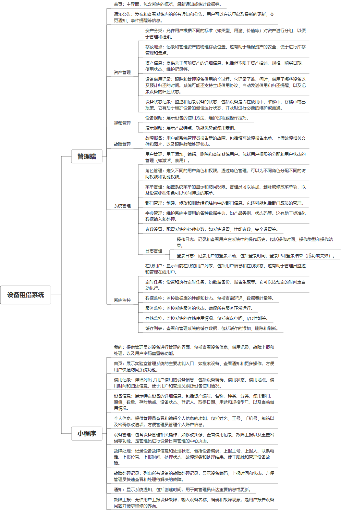

 

    
 

公司拥有上百套具有自主知识产权的软件系统，详情请查看码云首页或公司官网

 
<h1>设备租借系统</h1>

<a href="https://www.haishi.net.cn/">公司官网</a> ｜ <a href="https://www.haishi.net.cn/">在线体验</a>

 

## 系统介绍

nan
---
本项目名称为设备租借系统，是对企业内部设备进行信息化管理的系统，可以实现设备的借用、归还、状态跟踪等功能，方便企业对设备进行管理。
本项目从用户层面可以分为一个端：
- 管理端：公司内部管理员用户使用，可以进行资产分类、存放地点、资产信息、设备借用记录、设备状态记录、设备视频、演示视频、故障报备、用户管理、角色管理、菜单管理、部门管理、日志管理等。
---
                

## 系统功能介绍

### 系统包含终端说明

管理端（WEB）、用户端（微信小程序）

| 序号 | 模块                | 模块说明 |
| ---- | ------------------- | -------- |
| 1    | FWY-EMS-SBZJ-SERVER | 服务端   |
| 2    | FWY-EMS-SBZJ-MANAGE | 管理端   |
| 3    | FWY-EMS-SBZJ-MP     | 小程序   |

### 系统功能结构

### 系统功能说明

- 资产管理：对企业内部的资产进行分类管理，记录资产的存放地点、详细信息、借用记录、状态记录等信息，方便企业对资产进行管理。
- 视频管理：对设备相关的视频进行管理，包括设备视频和演示视频，方便用户了解设备的使用方法和注意事项。
- 故障管理：用户可以进行故障报备，方便企业及时处理设备故障，保证设备的正常使用。
- 系统管理：对系统进行管理，包括用户管理、角色管理、菜单管理、部门管理、日志管理等，保证系统的正常运行。

## 系统主要界面

## 系统技术说明

### 代码模块说明

| 序号 | 目录                              | 目录说明 |
| ---- | --------------------------------- | -------- |
| 1    | FWY-EMS-SBZJ-SERVER/lab-admin     | --       |
| 2    | FWY-EMS-SBZJ-SERVER/lab-framework | --       |
| 3    | FWY-EMS-SBZJ-SERVER/lab-system    | --       |
| 4    | FWY-EMS-SBZJ-SERVER/lab-common    | --       |
| 5    | FWY-EMS-SBZJ-SERVER/lab-quartz    | --       |
| 6    | FWY-EMS-SBZJ-SERVER/lab-generator | --       |

### 系统技术选型

#### 开发语言/框架

JAVA（JDK1.8）

#### 服务中间件

Nginx
Tomcat

#### 数据库

MySQL（5.7+）

#### 其他说明

无

## 系统演示/商用

请扫码添加客服微信获取演示地址和系统详细资料。

如果您想基于设备租借系统进行商业化交付或定制开发服务，我们提供有偿的技术服务支持，合作模式不限，欢迎沟通！

公司官网地址： <a href="https://www.haishi.net.cn/">https://www.haishi.net.cn</a>

联系客服获取专业回答。

## 使用须知

1、 本项目商用必须获得版权所有者的授权。

2、 未经允许本项目代码不允许二次出售。

